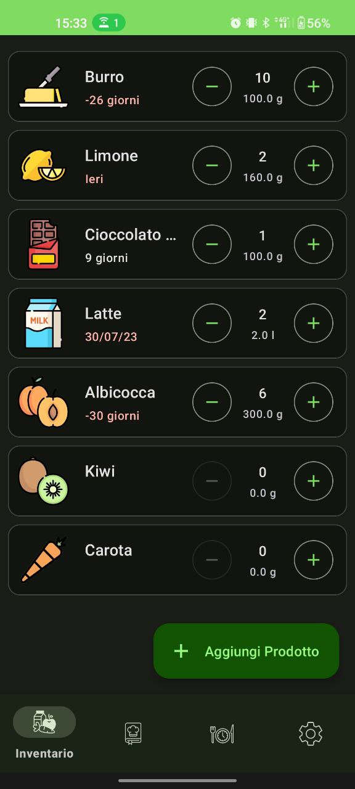
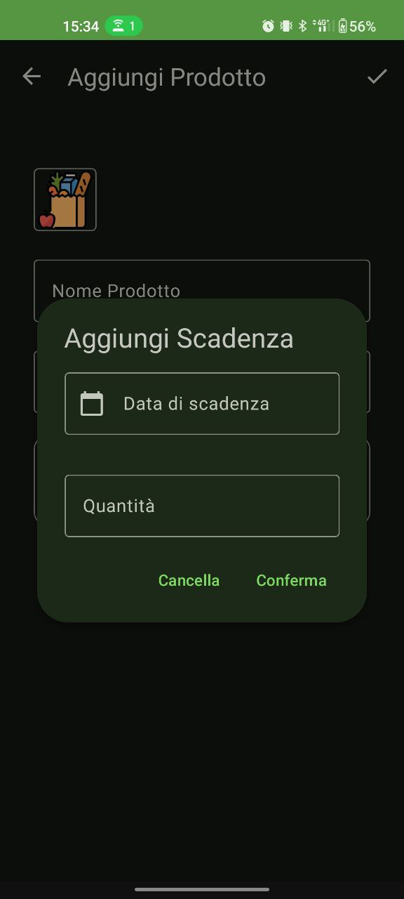
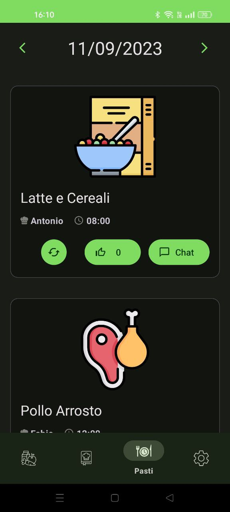
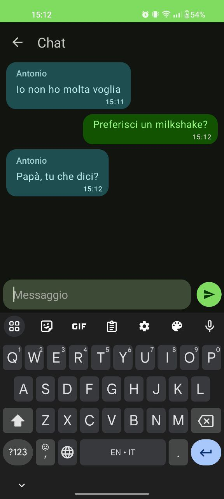

# FoodDex

This project was part of the finel exam for the course of Mobile Programming at University of Brescia.

FoodDex is an app that helps you keep track of the food in your pantry/fridge.

Developed in Kotlin using Android Studio.

Features
---

- Keep track of the items in your pantry/fridge, with the relative expiration dates
- Define recipes with the ingredient in your pantry/fridge
- Plan meals for yourself and your family
- Chat with your family member and give feedback on cooked meals

Screenshots
---

